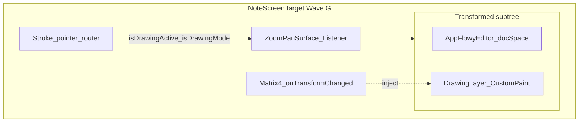

# Draw — end-to-end roadmap (`components/draw`)

This document is the **canonical plan** for Slote’s drawing subsystem: stroke model, rendering, gestures, erasure, coordinate alignment with the note editor, and **undo/redo** for ink (**separate** from AppFlowy `EditorState` history — see [Undo/redo (ink vs editor)](#undoredo-ink-vs-editor)).

**Boundary with rich text:** Ink lives in **`components/draw`**; the note body stays **AppFlowy Document JSON** in [`package:rich_text`](../../rich_text/docs/ROADMAP.md). Product composition (editor + drawing chrome) is a **note-screen** concern — today [`lib/src/views/create_note.dart`](../../../lib/src/views/create_note.dart) owns `DrawController`, `SloteDrawScaffold`, and persistence of `drawingData` on the note model.

---

## Direction

| Topic | Decision |
| ----- | -------- |
| **Rendering primitive** | **[`perfect_freehand`](https://pub.dev/packages/perfect_freehand)** — pure function from sampled points `[x, y, pressure]` to outline polygon vertices. **Do not** build on **high-level drawing packages** that own their own notifier/widget stack: that pattern fights **pixel erasure**, **coordinate transforms**, and **custom gesture routing**; you end up overriding more than you reuse. |
| **Gesture layer** | **`Listener`** / low-level **pointer** events — track **active pointer count** for **stroke capture**. The parent **viewport** (see below) also uses **`Listener`** for pan, pinch, and scroll — the two layers must agree on who owns motion when (**drawing on** vs **navigating**). Read **`PointerDownEvent.pressure`** / **`pressureMax`** where available. Avoid competing **`GestureDetector`** recognizers on the same pointers. |
| **Coordinates** | Store strokes in **document space**. On paint and hit-test, apply the live **`Matrix4`** from the viewport (**`onTransformChanged`** on [`ZoomPanSurface`](../../viewport/lib/src/zoom_pan/zoom_pan_surface.dart), or an equivalent single source of truth) so zoom/pan/scroll **never** mutate stored geometry. |
| **Pressure sensitivity toggle** | At sample time: if enabled, use device pressure; if disabled, use a **constant** pressure (e.g. `0.5`) so width stays uniform — **no** duplicate stroke types in the model. |
| **Draw-and-hold → straight line** | On stroke end: if **elapsed time** passes a hold threshold and samples stay within tolerance of the **first→last** chord (perpendicular distance; **hold-still** uses a small radius from the first point), replace the stroke with a **straight segment** from first to last. **Live preview** uses the same rule while the stroke is in progress (after the hold threshold). |
| **Erasure** | **First:** **stroke erasure** — hit-test stroke bounds (or tighter geometry later) and **remove whole** `Stroke` objects. **Later (optional):** **pixel erasure** — split point lists along the eraser path, or move to raster / **`BlendMode.clear`** if needed for performance. |
| **Pan / zoom / scroll** | **Slote-standard surface:** **[`package:viewport`](../../viewport)** — **`ViewportSurface`** / **`ZoomPanSurface`** — for pinch zoom, **1-finger pan** (when not in drawing-navigation mode), **wheel / trackpad** scroll, boundary clamping, and **`TransformAwareScrollbar`**. **`InteractiveViewer`** is a useful mental model only; **do not** assume it is the long-term note shell. Product wiring is **[Wave G](#wave-g--note-shell-viewport--editor--ink)**. |
| **Transform source of truth** | Authoritative **`Matrix4`** for the note document subtree: **`ZoomPanSurface.onTransformChanged`**. Scrollbar drags apply via **`ZoomPanController.applyTransform`** (same matrix after **`BoundaryManager`**). Draw consumes this matrix for paint and screen ↔ document mapping — **not** a second unsynchronized `TransformationController` unless you deliberately bridge them. |
| **Package layout** | **`lib/`** — public API via [`draw.dart`](../lib/draw.dart) (`DrawController`, `SloteDrawScaffold`, tools, …). **`example/`** — isolated dev loop. Root app depends on **`package:draw`** via path ([`pubspec.yaml`](../../../pubspec.yaml)). **`package:viewport`** is also a path dependency in root **`pubspec.yaml`**; the **note screen** composes both when integrating Wave G (draw stays **viewport-agnostic** if it only accepts **`Matrix4` + flags**). |

### Layer stack (product)

**Target (Wave G):** outer **[`ZoomPanSurface`](../../viewport/lib/src/zoom_pan/zoom_pan_surface.dart)** / **`ViewportSurface`** owns **`Listener`** (pan, pinch, wheel, trackpad), **`Matrix4`**, clip, and scrollbars. **Inside** the single **`Transform`**, child order is effectively:

1. **Editor** — `AppFlowyEditor` / document defines **logical extent** and block layout in **document space** (scroll ownership must be decided — see **double-scroll** note under [Viewport package](#viewport-package-componentsviewport)).
2. **DrawingLayer** — `CustomPaint` (or stack overlay) in the **same** transformed coordinate space as the editor; ink samples stored in **document space**.
3. **Stroke capture** — pointer routing for draw (1-finger stroke, pressure) **coordinated** with viewport flags **`isDrawingMode`** / **`isDrawingActive`** so pan/pinch/scroll and ink do not fight ([`gesture_handler.dart`](../../viewport/lib/src/zoom_pan/gesture_handler.dart)).

### Viewport package (`components/viewport`)

Slote’s zoom/pan/scroll implementation — **not yet** wrapped around the note editor + ink in [`create_note.dart`](../../../lib/src/views/create_note.dart); use **[`components/viewport/example`](../../viewport/example/lib/main.dart)** as the runnable reference.

| Piece | Role for draw / note shell |
| ----- | -------------------------- |
| **`ZoomPanSurface`** | Owns **`Matrix4 _transform`**, applies it with **`Transform`** around measured content. Top-level **`Listener`** for pointer pan, **2-finger pinch**, **`PointerSignalEvent`** (wheel), trackpad **`PointerPanZoomUpdate`**. **`onTransformChanged(Matrix4)`** — feed this into **`DrawCanvas`** / painter for screen ↔ document mapping. |
| **`isDrawingMode` / `isDrawingActive`** | When **`isDrawingMode`** is false, **1-finger drag pans** the surface. When true, that pan arm does not start on pointer down — room for **1-finger draw**. When **`isDrawingActive`** is true, **2-finger zoom** is suppressed so pinch does not fight an in-progress stroke. Wire these from the note UI + **`SloteDrawScaffold`** / stroke lifecycle ([`slote_draw_scaffold.dart`](../lib/src/ui/slote_draw_scaffold.dart) already tracks local drawing activity — must be **connected** to the viewport in Wave G). |
| **`ZoomPanController` + `TransformAwareScrollbar`** | Scrollbar position stays consistent with transform. |
| **`BoundaryManager` + `ContentMeasurer` / `contentHeight`** | Constrain pan/zoom; content extent must match **editor + ink** height when editor and drawing share one transformed subtree. |

**Risk (document explicitly):** AppFlowy’s **internal scroll** vs viewport **transform scroll** can **double-apply** motion if both are active on the same content. Wave G must pick **one owner** for “canvas” motion (usually the viewport wrapping a single document subtree) and document the choice.

### Development workflow

- **Path dependency:** Root [`pubspec.yaml`](../../../pubspec.yaml) lists `draw` with `path: components/draw`. The main app imports **`package:draw`**; edits under `components/draw/lib/` apply on the next analyze, run, or hot restart.
- **Where to run:** Use **`components/draw/example`** for a fast isolated loop; use the **root Slote app** for product flows ([`create_note.dart`](../../../lib/src/views/create_note.dart): drawing toggle, `drawingData` persistence).

---

## Current status (rolling)

| Item | State |
| ---- | ----- |
| **Stroke rendering** | [`StrokeRenderer`](../lib/src/stroke/stroke_renderer.dart) uses **`perfect_freehand`** **`getStroke`** (filled paths). Pen / highlighter; eraser commits are not drawn until **Wave D**. |
| **Stroke model** | [`Stroke`](../lib/src/stroke/stroke.dart): immutable **`StrokeSample`** (`x`, `y`, optional `pressure`), **`pressureEnabled`**; [`DrawController`](../lib/src/draw_controller.dart): **`schemaVersion`** in JSON, legacy `points` decode. |
| **Undo / redo (ink)** | **Not implemented** — `DrawController` appends strokes and `clear()` only; no history stack. |
| **Gestures** | [`DrawCanvas`](../lib/src/draw_canvas.dart): **`Listener`** + **pointer-count** router (**Wave B**): sample only when **`activePointers == 1`**; second finger **commits partial** stroke (see Wave B). |
| **Wave B — Gesture router** | **Complete** — same as phased [Wave B](#wave-b--gesture-router-1-draw--2-pan); [`slote_draw_scaffold.dart`](../lib/src/ui/slote_draw_scaffold.dart) **`isDrawingActive`** from **`onStrokeCaptureActiveChanged`**. |
| **Wave A foundation** | **Complete** — `perfect_freehand`, document-space samples + **`Matrix4`**, [`StrokeRenderer`](../lib/src/stroke/stroke_renderer.dart) **`getStroke`**. |
| **Wave C — Pen UX** | **Complete** — pressure **`Switch`** in [`SloteDrawScaffold`](../lib/src/ui/slote_draw_scaffold.dart); draw-and-hold straight line (**350 ms** hold, **24 px** max perpendicular deviation from **first→last** chord in **document space**, or **24 px** radius from first when the chord is ~zero) in [`straight_line_snap.dart`](../lib/src/stroke/straight_line_snap.dart) + [`draw_canvas.dart`](../lib/src/draw_canvas.dart); live preview uses **`StrokeRenderer`**. |
| **Editor alignment** | Main app uses **`SloteDrawScaffold`** in a **fixed-height footer** below the editor — **no** shared live **`Matrix4`** with the editor yet (optional transform defaults to identity). **Wave G** composes **`package:viewport`**. |
| **Viewport in product** | Root **`pubspec.yaml`** already lists **`viewport`**, but [`create_note.dart`](../../../lib/src/views/create_note.dart) does not import **`package:viewport`** yet. Pan/zoom/scroll for the note page is **Wave G**, not shipped. |
| **Persistence** | **`Note.drawingData`** JSON via `DrawController.toJson` / `fromJson` in [`create_note.dart`](../../../lib/src/views/create_note.dart); **`schemaVersion: 1`** for new saves, legacy payloads still load. |

## Next (Slote-focused)

1. **Wave D:** Stroke eraser (then optional pixel eraser).
2. **Wave E:** Ink undo/redo inside `draw` + optional note-level unified history later.
3. **Wave F:** JSON migration, APIs for transform + flags consumed by the note shell.
4. **Wave G:** End-to-end **viewport + editor + ink** in `create_note` (see table below).

---

## Phased delivery (waves)

Waves build on each other. After each major wave, run **`components/draw/example`**, **`flutter test`** under `components/draw`, and the **root app** when persistence or `create_note` integration changes.

### Wave A — Foundation (`perfect_freehand` + document space)

| Step | Scope |
| ---- | ----- |
| **A1 — Dependency** | Add **`perfect_freehand`** to [`pubspec.yaml`](../pubspec.yaml). |
| **A2 — Sample model** | Stroke samples as `(x, y, pressure)` (or library `PointVector` equivalent) + metadata: color, base size, **pressure enabled** flag. Migrate JSON **carefully** (version field or tolerant decode) because [`create_note`](../../../lib/src/views/create_note.dart) already persists strokes. |
| **A3 — Document space + transform** | API for the parent to supply **`Matrix4`** — primary hook: **`ZoomPanSurface.onTransformChanged`** (see [Viewport package](#viewport-package-componentsviewport)). **Store** points in **untransformed** document space; **transform only for painting** (and screen → document hit-testing). |
| **A4 — Render path** | Replace or wrap [`StrokeRenderer`](../lib/src/stroke/stroke_renderer.dart) to build outlines via **`getStroke`** (filled path from polygon), including **`simulatePressure`** when useful for devices without stylus. |

**Status: complete** (A1–A4 implemented in [`pubspec.yaml`](../pubspec.yaml), [`stroke.dart`](../lib/src/stroke/stroke.dart), [`draw_controller.dart`](../lib/src/draw_controller.dart), [`draw_canvas.dart`](../lib/src/draw_canvas.dart), [`stroke_renderer.dart`](../lib/src/stroke/stroke_renderer.dart)).

### Wave B — Gesture router (1 draw / 2 pan)

| Step | Scope |
| ---- | ----- |
| **B1 — Pointer counting** | On down/up/cancel, maintain **`activePointers`**. On move: **only** continue stroke when **`activePointers == 1`**. |
| **B2 — Parent contract** | **Second finger mid-stroke:** **`PointerDown`** when **`activePointers` becomes 2** while a stroke is in progress → **commit partial** (same as a normal stroke end), clear in-progress capture, **`onStrokeCaptureActiveChanged(false)`** so **`isDrawingActive`** is false and [`ZoomPanSurface`](../../viewport/lib/src/zoom_pan/zoom_pan_surface.dart) may apply **2-finger pinch** (`pointerCount == 2 && !isDrawingActive`). **`PointerCancel`** on the drawing pointer → **discard** in-progress ink (no commit). Aligns with [`gesture_handler.dart`](../../viewport/lib/src/zoom_pan/gesture_handler.dart) pointer counting. |
| **B3 — Pressure at source** | Pipe **`PointerEvent.pressure`** into the sample stream when pressure mode is on. |

**Status: complete** — [`DrawCanvas`](../lib/src/draw_canvas.dart) (`Listener`, **`onStrokeCaptureActiveChanged`**); [`SloteDrawScaffold`](../lib/src/ui/slote_draw_scaffold.dart) wires **`isDrawingActive`** from that callback.

### Wave C — Pen UX

| Feature | Notes |
| ------- | ----- |
| **Pressure toggle** | UI + controller: when off, pass **constant** pressure into `perfect_freehand` inputs. |
| **Straight line (draw-and-hold)** | Thresholds on duration + distance; snap on pointer up; optional live preview after threshold. |
| **Live preview** | In-progress stroke uses the **same** pipeline as committed strokes. |

**Status: complete** — [`SloteDrawScaffold`](../lib/src/ui/slote_draw_scaffold.dart) pressure toggle; [`straight_line_snap.dart`](../lib/src/stroke/straight_line_snap.dart) (**350 ms**, **24 px** max deviation from **first→last** chord, hold-still radius fallback) + [`draw_canvas.dart`](../lib/src/draw_canvas.dart) commit + straight preview.

### Wave D — Erasure

| Slice | Notes |
| ----- | ----- |
| **D1 — Stroke eraser** | Hit-test **stroke bounds** (then refine if needed); remove entire strokes. Fast, predictable UX. |
| **D2 — Pixel eraser (optional)** | Split stroke polylines along eraser path, or rasterize + **`BlendMode.clear`** if vector splitting is too heavy. Defer until D1 is stable. |

### Wave E — Undo / redo (ink)

| Item | Notes |
| ---- | ----- |
| **E1 — Draw-local history** | **Undo** / **redo** for **committed** ink operations (strokes; erasures if modeled as mutations). Implementation options: **command list** or **snapshots** of the stroke list — choose by tolerance for memory vs simplicity. |
| **E2 — UI hooks** | Expose something like **`Listenable`** for can-undo / can-redo (mirror the ergonomics of **`RichTextEditorController.undoRedoListenable`** in [`package:rich_text`](../../rich_text/lib/src/appflowy/appflowy_document_controller.dart)) so [`SloteDrawScaffold`](../lib/src/ui/slote_draw_scaffold.dart) or the app bar can enable/disable buttons. |
| **E3 — Non-goal** | Do **not** assume ink can call **`EditorState.undoManager.undo()`** without either **embedding** strokes in the document transaction model or a **note-level orchestrator** (see below). |

### Wave F — Integration & persistence

| Item | Notes |
| ---- | ----- |
| **F1 — Transform parity** | With Wave G: drawing layer and editor sit under the **same** **`ZoomPanSurface`** **`Transform`**; ink uses the same **`Matrix4`** as blocks. |
| **F2 — JSON / migration** | Evolve `DrawController.toJson` / `fromJson` with the new stroke sample shape; keep **backward compatibility** for existing `drawingData` in the wild. |
| **F3 — Product wiring** | [`create_note.dart`](../../../lib/src/views/create_note.dart) already wires **`DrawController`**, **`SloteDrawScaffold`**, and **`drawingData`** — extend for undo, transform injection, and viewport flags. |

### Wave G — Note shell: viewport + editor + ink

End-to-end integration of **zooming, panning, and scrolling** with the note page. **`draw`** can stay **viewport-agnostic** (`Matrix4` + booleans); [`create_note.dart`](../../../lib/src/views/create_note.dart) (or an extracted shell widget) owns composition.

| Step | Scope |
| ---- | ----- |
| **G1 — Compose** | Wrap **one** transformed subtree in **`ViewportSurface`** / **`ZoomPanSurface`**: **AppFlowy editor + drawing overlay** share the same **`Transform`** (single document coordinate space). |
| **G2 — Transform pipe** | Subscribe to **`onTransformChanged`**; pass **`Matrix4`** into `DrawController` / `DrawCanvas` / `StrokeRenderer` for paint and pointer mapping. |
| **G3 — Flags** | Wire **`isDrawingMode`** ↔ note “drawing on/off”; wire **`isDrawingActive`** ↔ stroke-in-progress from draw so **2-finger pinch** does not fight ink (see viewport source). |
| **G4 — Scroll ownership** | Decide **one** owner for vertical motion: viewport wheel/trackpad (`_applyScrollDelta` in `zoom_pan_surface.dart`) vs editor-internal scroll — avoid **double scroll**. Document the choice in code comments. |
| **G5 — Content extent** | Align **`ContentMeasurer` / `contentHeight`** (and **`BoundaryManager`**) with **real document height** (editor + ink). |
| **G6 — QA** | Run **`components/viewport/example`**, **`components/draw/example`**, root app, and **`flutter test`** after shell changes. |

_When verifying Wave G, re-read [`zoom_pan_surface.dart`](../../viewport/lib/src/zoom_pan/zoom_pan_surface.dart) for the exact **`isDrawingMode` / `isDrawingActive`** / pointer-count behavior._

---

## Undo/redo (ink vs editor)

### Rich text (AppFlowy) — unchanged

- Note body undo/redo is **`EditorState.undoManager`** — see [`appflowy_undo_support.dart`](../../rich_text/lib/src/appflowy/appflowy_undo_support.dart) and **[Undo/redo (AppFlowy)](../../rich_text/docs/ROADMAP.md#undoredo-appflowy)** in the rich_text roadmap.
- That stack only understands **document transactions**. It does **not** automatically include **freehand strokes** stored alongside the note.

### In `package:draw`

- **Ink history** should live **inside** `draw` (minimal undo stack or commands). The removed standalone **`components/undo_redo`** package is **not** required for this; reintroducing a generic package is optional only if multiple subsystems need the same abstraction.
- **Erasure** and other tools should define whether they push **undoable** operations; the roadmap stays **agnostic** between snapshot vs command-list implementations.

### Rest of repo / product

- **Two independent stacks today:** text history (AppFlowy) and drawing (none until Wave E).
- **Future (optional):** a **note-level facade** could merge **chronological** undo (one Cmd+Z ordering across typing and ink). That is **explicitly deferred** until product requires it — it is **not** “wiring drawing into AppFlowy undo” without either **stroke-as-document-embed** or a coordinator.

---

## Repo touchpoints

| Area | Path |
| ---- | ---- |
| Package exports | [`lib/draw.dart`](../lib/draw.dart) |
| Controller + JSON | [`lib/src/draw_controller.dart`](../lib/src/draw_controller.dart) |
| Canvas / paint | [`lib/src/draw_canvas.dart`](../lib/src/draw_canvas.dart), [`lib/src/stroke/stroke_renderer.dart`](../lib/src/stroke/stroke_renderer.dart) |
| Example (isolated dev) | [`example/`](../example) |
| Main app note + ink | [`lib/src/views/create_note.dart`](../../../lib/src/views/create_note.dart) |
| Zoom/pan/scroll (component) | [`components/viewport/lib/viewport.dart`](../../viewport/lib/viewport.dart), [`zoom_pan_surface.dart`](../../viewport/lib/src/zoom_pan/zoom_pan_surface.dart) |
| Viewport demo | [`components/viewport/example/lib/main.dart`](../../viewport/example/lib/main.dart) |
| Rich text boundary | [`components/rich_text/docs/ROADMAP.md`](../../rich_text/docs/ROADMAP.md) (e.g. Wave F — draw / ink) |

---

## Related Slote docs

- **[`components/rich_text/docs/ROADMAP.md`](../../rich_text/docs/ROADMAP.md)** — editor stack, AppFlowy undo/redo, draw/ink boundary.
- **[`components/viewport/example/README.md`](../../viewport/example/README.md)** — viewport demo app (package root has no README yet).
- **[`PRD.md`](../../../PRD.md)** — product scope and component inventory.
- **[`README.md`](../README.md)** — package overview (link to this file).

---

_Roadmap versions with the product; prefer this file for engineering planning for ink._
