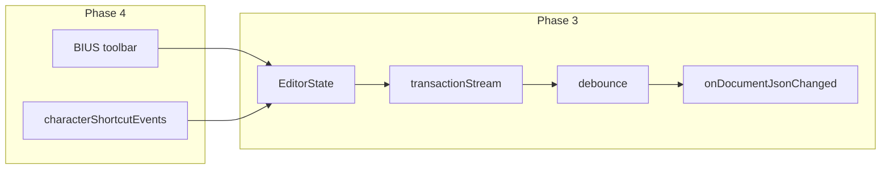

# AppFlowy Editor integration roadmap (`rich_text`)

**Full product and feature roadmap:** see **[ROADMAP.md](ROADMAP.md)** (end-to-end phases, feature waves, listeners, `undo_redo` consolidation).

This file stays focused on **AppFlowy Editor** milestones: Document JSON, BIUS, controller/debounce, shortcuts, and short-term deferred items.

**Canonical direction:** Prefer **AppFlowy Document JSON** as the source of truth for pixel-perfect round-trip. Use Markdown or Delta only for migration when needed ([importing.md](https://raw.githubusercontent.com/AppFlowy-IO/appflowy-editor/main/documentation/importing.md)).

---

## Execution model (divide and conquer)

- **Phase 1:** Work alone on AppFlowy JSON (load, edit, export, debug). No bulk assistant implementation until Phase 1 is done.
- **Phases 2–4:** Implement incrementally with review; after each phase, run the example app and tests before the next.
- **Later waves:** Extended inline, blocks, media, TOC, theming — scheduled in [ROADMAP.md](ROADMAP.md).

---

## Phase 1 — AppFlowy JSON (solo)

- Use `components/rich_text/example` (or a scratch screen): `EditorState(document: Document.fromJson(...))`, then serialize back after edits.
- Goals:
  - Confidence in JSON shape and undo behavior.
  - Understand what changes in the document on each keystroke (deltas in nodes).
  - Validate that edits persist correctly through a load/save round-trip.

---

## Phase 2 — BIUS toolbar

- Build a **fixed** row (e.g. under the editor) or reuse **MobileFloatingToolbar** / desktop patterns from `appflowy_editor`. The package provides **building blocks**; you **compose** the screen ([pub.dev overview](https://pub.dev/packages/appflowy_editor)).
- Toolbar scope: four actions only — **Bold**, **Italic**, **Underline**, **Strikethrough** (BIUS).
- Note: `AppFlowyEditor` alone does not ship a complete toolbar; expect to wire UI to editor APIs yourself (same idea as floating-toolbar examples in the package).

---

## Phase 3 — Controller + listener + debounce

- Single owner of `EditorState` (e.g. `RichTextController` or equivalent).
- Subscribe to `editorState.transactionStream` (or the equivalent change signal), **debounce** (~200 ms), then emit canonical Document JSON (string or `Map`) for persistence, preview, or logging.
- `dispose()`: cancel the subscription and dispose `EditorState` cleanly.

### Data flow (Phases 3–4)

---

## Phase 4 — BIUS via shortcuts + parity with toolbar

- Use [Customizing Editor Features — shortcut event](https://github.com/AppFlowy-IO/appflowy-editor/blob/main/documentation/customizing.md#customizing-a-shortcut-event) as reference: `CharacterShortcutEvent`, injected via `AppFlowyEditor.custom` / `characterShortcutEvents`, and format commands as needed.
- Pub.dev examples also cover **BIUS** shortcuts ([appflowy_editor](https://pub.dev/packages/appflowy_editor)).
- **Selection:** formatting applies to the current selection; with a **collapsed** caret, behavior should match the editor (e.g. format applies to the **next** typed run).
- **Parity:** toolbar buttons and shortcuts must call the **same** formatting entry points on `EditorState`.

---

## AppFlowy-only deferred (superseded by ROADMAP.md for detail)

The numbered list below is the **original** narrow scope; the **full** backlog (tables, callouts, LaTeX, TOC, etc.) lives in [ROADMAP.md](ROADMAP.md).

1. **Block components** — tables, checklist, numbered/bullet lists, quote, code blocks, etc. (extend `blockComponentBuilders` / custom blocks per AppFlowy docs).
2. **Encryption / decryption** — logic lives in another component; integrate at the app boundary with the debounced JSON payload, not inside `rich_text` core.
3. **Draw / ink** — separate component/folder; integrate with document or overlay per broader architecture notes.
4. **Theming** — `appflowy_editor` uses `EditorStyle` / `BlockComponentConfiguration` ([customizing.md — theme](https://github.com/AppFlowy-IO/appflowy-editor/blob/main/documentation/customizing.md#customizing-a-theme)); bridge to Slote `components` theme so Material/app theme and editor styling stay consistent (bridge layer TBD).

---

## Slote fork: caret height at EOT & sup/sub layout

End-to-end **feature** documentation (delta keys, toggles, markdown, app wiring): [SUPERSCRIPT_SUBSCRIPT.md](SUPERSCRIPT_SUBSCRIPT.md).

The app uses a **vendored** [`components/appflowy_editor`](../../appflowy_editor) (see [ROADMAP.md](ROADMAP.md) → COMPLIANCE). These hooks exist only in the fork:

| Behavior | What we did | Where |
|----------|-------------|--------|
| **Tall caret at end of paragraph** | With mixed superscript/subscript on a line, the EOT caret no longer inherits the line’s full strut height from placeholder merging. **`EditorStyle`** exposes `endOfParagraphCaretHeight` (`EndOfParagraphCaretHeightResolver?`). At EOT, `AppFlowyRichText.getCursorRectInPosition` calls it; if it returns a height, placeholder `max` merge for that rect is skipped when the paragraph is non-empty. | Fork: `editor_style.dart`, `appflowy_rich_text.dart`. Slote: [`lib/src/appflowy/slote_end_of_paragraph_caret_height.dart`](../lib/src/appflowy/slote_end_of_paragraph_caret_height.dart) — uses `EditorState.toggledStyle` + `TextPainter` + `SloteSupSubMetrics` so the caret height matches **what the user would type next** (e.g. after toggling sup/sub). Wire with `EditorStyle.copyWith(endOfParagraphCaretHeight: sloteEndOfParagraphCaretHeight)` in the app/example. |
| **Caret inside multi-char sup/sub** | One `TextSpan` of script became one `WidgetSpan` → one placeholder vs many offsets; the caret could skip the run. **Mitigation:** plain sup/sub runs are expanded to **one `WidgetSpan` per UTF-16 code unit** (not a single baseline `TextStyle` — stable Flutter lacked `baselineShift` in `copyWith` when this shipped). | [`slote_text_span_decorator.dart`](../lib/src/appflowy/slote_text_span_decorator.dart) |

**Example app:** `components/rich_text/example` must override `appflowy_editor` to the **same** path as root/`rich_text` or new `EditorStyle` fields will not resolve at analyze time.

---

## Repo touchpoints (when implementing)

| Area | Path |
|------|------|
| Dependency | [`pubspec.yaml`](../pubspec.yaml) — add `appflowy_editor` when the editor lives in `lib/`, not only the example. |
| Public API | [`lib/rich_text.dart`](../lib/rich_text.dart) — export controller/widget when added. |
| Spike / evolution | [`example/lib/main.dart`](../example/lib/main.dart) — evolve through phases. |

---

## Phase checklist (tracking)

Use this list to track progress locally (e.g. in PRs or issues).

- [x] **Phase 1 (solo):** JSON round-trip, delta inspection, persistence validation in the example app.
- [x] **Phase 2:** Minimal BIUS toolbar wired to editor APIs.
- [x] **Phase 3:** Controller + `transactionStream` + debounced JSON callback + clean dispose.
- [x] **Phase 4:** BIUS shortcuts/commands aligned with toolbar behavior.
- [ ] **Deferred:** Broader features per [ROADMAP.md](ROADMAP.md) after the above are stable.
