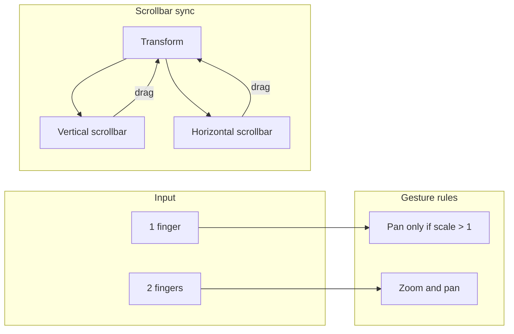

# Viewport: zoom, pan, and scrollbar sync

This document captures the **design plan** and **implementation summary** for viewport zoom, pan, and scrollbar behavior in `viewport`.

---

## Plan (design document)

*Source: `viewport_zoom_pan_scrollbar` plan. Overview: enable zoom and pan in the viewport (by using ZoomPanSurface where ViewportSurface is used), restrict pan to zoomed state only, sync pan with scrollbars (including making scrollbars interactive), and ensure 1-finger pan vs 2-finger zoom transition and no gesture conflicts.*

### Current state (at plan time)

- **ViewportSurface** (`lib/src/viewport/viewport_surface.dart`) wrapped the child in a `Stack` and did **not** apply any transform or zoom; it was effectively a pass-through. The test app and `create_note.dart` used it expecting zoom (e.g. `onScaleChanged`, `minScale`, `maxScale`) but zoom never happened.
- **ZoomPanSurface** (`lib/src/zoom_pan/zoom_pan_surface.dart`) already implemented:
  - 2-finger pinch zoom (with focal-point pan) via raw `Listener` and GestureHandler.
  - 1-finger pan when **not** in drawing mode (no “only when zoomed” check).
  - TransformAwareScrollbar: **read-only** vertical thumb driven by `BoundaryManager.getScrollPosition(transform)`; no horizontal scrollbar; **no drag-to-pan** from scrollbar.
- **BoundaryManager** constrained scale and translation (X and Y); it exposed `getScrollPosition` / `getScrollExtent` only for **vertical** (Y). No horizontal scroll position/extent helpers.

### Architecture (target)

### Design decisions (from plan)

1. **Enable zoom:** ViewportSurface delegates its `build` to ZoomPanSurface (same API), so all ViewportSurface usages get zoom/pan without call-site changes.
2. **Pan only when zoomed:** 1-finger pan allowed only when scale > 1.0 (and not in drawing mode). At scale == 1.0, 1-finger drag does nothing; 2-finger pinch still zooms and can pan via focal movement.
3. **Scrollbar sync:**  
   - Panning updates vertical (and horizontal) scrollbar thumb.  
   - BoundaryManager gets `getScrollPositionX`, `getScrollExtentX`, and a method to build transform from scroll positions.  
   - ZoomPanController exposes `applyTransform(Matrix4)` so scrollbar drag can set the transform.  
   - TransformAwareScrollbar: vertical and horizontal thumbs, both draggable; on drag, compute new scroll position, then new transform via BoundaryManager, and call controller.
4. **Zoom and pan together (2 fingers); 1-finger → add finger → zoom:**  
   - Two fingers: existing `calculateZoomTransform()` (scale + focal pan).  
   - 1 → 2: second pointer down initializes zoom from current transform (no change).  
   - 2 → 1: on pointer up/cancel, when pointerCount becomes 1, re-initialize pan (e.g. `reinitializePanFromCurrentPointer(Matrix4)`) so the next move does not jump.
5. **No gesture conflicts:** Single `Listener` for pointers; 1 pointer = pan only if zoomed; 2 pointers = zoom; scrollbar in a separate Stack layer so drag on thumb is scrollbar, drag on content is pan/zoom.
6. **Test app:** Child of ViewportSurface is zoomable content only (no inner SingleChildScrollView/Scrollbar); content is a Column (or similar); scrollbars come from ZoomPanSurface/TransformAwareScrollbar.
7. **Cleanup:** Remove or guard debug `log()` in BoundaryManager and GestureHandler.

### File-level summary (from plan)

| File | Changes |
|------|--------|
| viewport_surface.dart | Delegate build to ZoomPanSurface; pass contentHeight, onScaleChanged, minScale, maxScale, showScrollbar, isDrawingMode, isDrawingActive, child. |
| zoom_pan_surface.dart | Gate 1-finger pan on scale > 1.0; on pointer up/cancel when pointerCount becomes 1, re-initialize pan; add ZoomPanController to set transform from scrollbar. |
| gesture_handler.dart | Add `reinitializePanFromCurrentPointer(Matrix4 transform)` when transitioning from 2 to 1. |
| boundary_manager.dart | Add getScrollPositionX, getScrollExtentX; add method to compute transform from scroll positions (e.g. `transformForScrollPosition(scale, scrollX, scrollY)`). |
| transform_aware_scrollbar.dart | Add horizontal scrollbar; make vertical and horizontal thumbs interactive (drag → compute scroll position → apply transform via controller). |
| test_viewport_screen.dart | Remove SingleChildScrollView and Scrollbar around content; pass content as direct child of ViewportSurface. |

### Order of implementation (from plan)

1. BoundaryManager: horizontal scroll helpers and “scroll position → transform” helper.  
2. GestureHandler: re-initialize pan when going from 2 to 1 pointer.  
3. ZoomPanSurface: gate 1-finger pan on scale > 1.0; re-init pan on pointer up/cancel when count goes to 1; add controller for “set transform”.  
4. TransformAwareScrollbar: horizontal scrollbar; make both scrollbars draggable and call back to set transform.  
5. ViewportSurface: delegate to ZoomPanSurface with correct parameter mapping.  
6. Test app: switch to non-scrolling child and remove inner Scrollbar/ScrollView.  
7. Cleanup: optional log removal and scroll_controller usage check.

---

## Implementation summary (this thread)

Implementation followed the plan above. Summary of what was done:

### 1. BoundaryManager (`lib/src/zoom_pan/boundary_manager.dart`)

- Added **getScrollPositionX(Matrix4)** and **getScrollExtentX(Matrix4)** for horizontal scroll (0.0–1.0 and visible-portion ratio).
- Added **transformForScrollPosition(scale, scrollX, scrollY)** to build a full transform from scroll positions for scrollbar-driven pan.
- Removed debug `log()` calls from **constrain()**.

### 2. GestureHandler (`lib/src/zoom_pan/gesture_handler.dart`)

- Added **reinitializePanFromCurrentPointer(Matrix4)** to set `_initialPanTransform` and `_initialPanPosition` from the current single pointer when transitioning from 2 fingers to 1 (avoids jump on next move).
- Removed debug `log()` from **resetPanState()** and **calculatePanTransform()**.

### 3. ZoomPanSurface (`lib/src/zoom_pan/zoom_pan_surface.dart`)

- Introduced **ZoomPanController**: holds reference to state, exposes **applyTransform(Matrix4)** so scrollbar (or others) can set transform; optional, attached in initState/didUpdateWidget/dispose.
- **Pan only when zoomed:** 1-finger pan runs only when **scale > 1.0** (and not drawing mode) in both `_handlePointerDown` and `_handlePointerMove`.
- On **pointer up / cancel**, when `pointerCount == 1`, calls **reinitializePanFromCurrentPointer(_transform)** for a smooth 2→1 transition.
- Passes **controller?.applyTransform** into TransformAwareScrollbar as **onTransformApplied**.
- Removed debug logs from **_updateContentSize**.

### 4. TransformAwareScrollbar (`lib/src/zoom_pan/transform_aware_scrollbar.dart`)

- Added optional **onTransformApplied** callback (void Function(Matrix4)?).
- **Horizontal scrollbar:** shown when scrollExtentX < 1.0, positioned at bottom with its own thumb.
- **Interactive thumbs:** vertical and horizontal thumbs use GestureDetector + onPanUpdate; new scroll position is derived from drag, then **boundaryManager.transformForScrollPosition(scale, scrollX, scrollY)** and **onTransformApplied(newTransform)**.
- Replaced private static constants with library-level **_kTrackWidth**, **_kTrackHeight**, **_kMargin** so thumb widgets can reference them.

### 5. ViewportSurface (`lib/src/viewport/viewport_surface.dart`)

- **build** now delegates to **ZoomPanSurface** with the same API (child, isDrawingMode, isDrawingActive, contentHeight, onScaleChanged, onTransformChanged, minScale, maxScale, showScrollbar).
- Creates and passes a **ZoomPanController** so the scrollbar is interactive without changing the ViewportSurface API.

### 6. Test app (`test/lib/test_viewport_screen.dart`)

- Removed ScrollController, Scrollbar, SingleChildScrollView, ScrollbarTheme, MouseRegion, and AnimatedBuilder.
- ViewportSurface’s child is a **SizedBox(height: 2000)** with a padded **Column** of content; **contentHeight: 2000** is passed for boundaries so zoom + pan can be tested.
- Updated on-screen instructions to match the new behavior.

### 7. Cleanup

- Removed all **log()** usage from BoundaryManager, GestureHandler, and ZoomPanSurface (and the **dart:developer** import where it was only used for logs).

### Verification

- `flutter analyze lib/` for the package reports no errors (only pre-existing deprecation infos).
- Test app analyzes successfully (optional lint: prefer_final_fields for _isDrawingActive).

---

## Reference: key APIs

- **ZoomPanController** (in zoom_pan_surface.dart): optional; **applyTransform(Matrix4)** to set transform from outside (e.g. scrollbar drag).
- **BoundaryManager**: **getScrollPosition**, **getScrollExtent** (vertical); **getScrollPositionX**, **getScrollExtentX** (horizontal); **transformForScrollPosition(scale, scrollX, scrollY)** for scrollbar-driven pan.
- **GestureHandler**: **reinitializePanFromCurrentPointer(Matrix4)** for 2→1 finger transition.
- **TransformAwareScrollbar**: **onTransformApplied** (optional); when set, vertical and horizontal thumbs are draggable and update the viewport transform via the controller.
