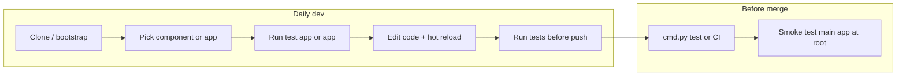

# Dev flow and structure advice

Recommendations to speed up the Slote monorepo dev process: extend `cmd.py` as the single script entry point (no Melos), fix placeholder widget tests, add minimal CI, and document a daily workflow.

**Note:** The main app already lives at repo root and components live under `components/`. Paths below use the current layout.

---

## Current state (summary)

- **Monorepo:** Main app at repo root + [components/](../components/) (viewport, rich_text, draw, theme, shared). No root-level Melos, no CI.
- **Component test/example apps:** Several packages have a runnable app under `example/` or `test/` (e.g. viewport has `example/`, draw/rich_text have `example/`). Workflow is manual: `cd components/<name>/example` (or `test/`), `flutter pub get`, `flutter run`.
- **Tests:** Widget tests exist in the main app [test/](../test/) and in component example/test apps. Some may still be the default Flutter counter test; if a test app’s home screen is not the counter, that widget test would fail. No integration tests; no automated test run across the repo.
- **Docs:** [README.md](../README.md), [COMPONENT_TEST_PLATFORMS.md](../components/COMPONENT_TEST_PLATFORMS.md), [CONCURRENT_DEVELOPMENT_GUIDE.md](CONCURRENT_DEVELOPMENT_GUIDE.md) describe setup and concurrent work. A single “daily workflow” entry point and scripts can reduce repetition.

---

## Recommended changes (in order of impact)

### 1. Keep the main app at repo root

**Goal:** Repo root is the main Flutter project so you can run the app and its tests without `cd` into a subfolder. This is already the case; ensure all docs and scripts assume root as the default.

**If the app were ever in a subfolder:**

- Move all contents of the app directory to the repo root (`lib/`, `test/`, `pubspec.yaml`, `android/`, `ios/`, etc.).
- In the root `pubspec.yaml`, set component path dependencies to `components/<name>`.
- In [cmd.py](../cmd.py), use repo root as `cwd` for the run command; adjust any DB or path logic that assumed a subfolder.
- Update docs to say “app at repo root” and fix any paths that reference an app subfolder.

**Result:** From repo root, `flutter run`, `flutter test`, and `flutter pub get` apply to the main app. Single place to open in the IDE for app work.

---

### 2. Unified scripts: extend cmd.py (no Melos)

**Problem:** Running a component test app or “all tests” still requires manual `cd` and multiple commands. You want one entry point and no new tools.

**Recommendation:** Extend [cmd.py](../cmd.py) as the single script for the repo. Do **not** add Melos; keep zero extra dependencies and one script everyone already uses.

**Add to cmd.py:**

- **Run app:** Already exists; run from repo root (e.g. `cwd=script_dir`).
- **Bootstrap (optional):** `python3 cmd.py bootstrap` — run `flutter pub get` at root and in each component that has its own runnable app (`example/` or `test/`) so everything is ready in one go.
- **Component run:** `python3 cmd.py component run <name>` — run `flutter run` from `components/<name>/example` (or `test/`) (e.g. `component run viewport`, `component run draw`). List supported names in help.
- **Test all:** `python3 cmd.py test` — run `flutter test` at root and in each component runnable app. Fails if any fail.

The main app is “just run from root”; component test apps are reached via `cmd.py component run` or by cd’ing. No Melos required.

---

### 3. Fix or remove placeholder widget tests

**Problem:**

- The app’s widget test and some component test apps’ widget tests expect a counter (0/1, `Icons.add`).
- If a test app’s home is a custom screen (e.g. a viewport test screen) with no counter, `flutter test` in that app would fail.
- This blocks “run all tests” and undermines trust in tests.

**Options:**

- **Option A (minimal):** In each component test app, change the widget test to assert on something that **actually exists** on the test screen (e.g. a title, a key, or a characteristic widget). Same for the main app if it is not a counter: make the test match the real entry screen or remove it.
- **Option B:** Remove the default counter test from component test apps and add one small, real widget test that pumps the component’s public widget and checks one visible behavior. Keeps `flutter test` meaningful without much effort.

**Recommendation:** Do at least Option A so that `flutter test` passes everywhere; prefer Option B where you want a quick regression check on the component’s UI.

---

### 4. Add minimal CI (e.g. GitHub Actions)

**Problem:** Nothing runs automatically on push/PR. Breaks are found only when someone runs the app or tests locally.

**Suggestion:** One workflow that:

- Checks out repo, sets up Flutter, runs `flutter pub get` at repo root and in each component runnable app.
- Runs `flutter analyze` at repo root and in each package under `components/`.
- Runs `flutter test` at repo root and in each component runnable app so that the current (or fixed) widget tests are executed.

This gives a single “green/red” for “the repo builds and passes analysis and tests,” which speeds up reviews and prevents regressions from landing on main.

---

### 5. Single “daily workflow” doc and optional ownership

**Problem:** CONCURRENT_DEVELOPMENT_GUIDE and COMPONENT_TEST_PLATFORMS are good but scattered. New or part-time devs need one place that says: “Day to day, do this.”

**Suggestion:**

- Add a short **Development workflow** section or a [DEV_WORKFLOW.md](DEV_WORKFLOW.md) that links to existing docs and spells out:
  - **Setup once:** clone, Flutter version, run bootstrap (`python3 cmd.py bootstrap`) or manual `flutter pub get` at root and in component apps as needed.
  - **Working on a component:** run `python3 cmd.py component run <name>` (or cd to `components/<name>/example` and `flutter run`), edit `../lib/`, hot reload; run `flutter test` in that app before pushing.
  - **Working on the app:** from repo root, `flutter run` or `python3 cmd.py run`; run `flutter test` at root before pushing.
  - **Before merging:** run `python3 cmd.py test`, and optionally smoke-test the main app (run and use the feature that uses your component).
- Optionally add a small **ownership** table (e.g. in README or DEV_WORKFLOW): who’s primary for which component (viewport, rich_text, draw). Reduces “who do I ask?” and avoids two people changing the same component without coordination.

No structural change beyond the app-at-root assumption—only one clear entry point for “how we develop and test.”

---

### 6. Optional: test apps for theme and shared

**Current:** Only some components have a runnable `example/` or `test/` app. theme and shared may not.

**Suggestion:** Add minimal test apps only if the team often changes theme or shared utilities and wants to see them in isolation (e.g. theme switcher, or a screen that uses shared widgets). Otherwise leave as-is and test via the main app and other components. Low priority.

---

### 7. Keep the current “test/example app per component” pattern

Using a runnable app under `test/` or `example/` is already documented and works. Renaming or moving “real” tests to a package-level `test/` would be a large refactor with limited benefit. **Recommendation:** keep the current structure; focus on scripts, CI, and fixing the existing widget tests so they pass and, where useful, assert on real behavior.

---

## High-level flow (after changes)

---

## Suggested order of implementation

| Priority | Action | Effect |
| -------- | ------ | ------ |
| 1 | Ensure app at repo root; path deps and cmd.py run use root | Root = main app; IDE default is app |
| 2 | Extend cmd.py: bootstrap, component run `<name>`, test | Single entry point for app run, component run, and “test all” |
| 3 | Fix or remove placeholder widget tests (at least so they pass) | Enables “run all tests” and CI |
| 4 | Add CI (e.g. GitHub Actions) for pub get, analyze, test at root + component apps | Catches breakages before merge |
| 5 | Add DEV_WORKFLOW.md (or section) + optional ownership | Clear onboarding and daily flow |

Optional later: test apps for theme/shared if needed; more widget tests for critical components.

---

## Summary

- **Structure:** Main app at **repo root** so `flutter run` / `flutter test` / `flutter pub get` from root are the default. Keep `components/` and the runnable app per component under `example/` or `test/`.
- **Scripts:** **Extend cmd.py only** (no Melos): run app from root, `cmd.py component run <name>` for component apps, `cmd.py test` for all tests, optional `cmd.py bootstrap`. One script, no new tools.
- **Quality:** **Fix or replace placeholder widget tests** so they pass and, where useful, assert on real behavior; add **CI** to keep the bar green.
- **Team:** Document a **single daily workflow** and optionally **component ownership** so everyone can work confidently without repeating instructions.
