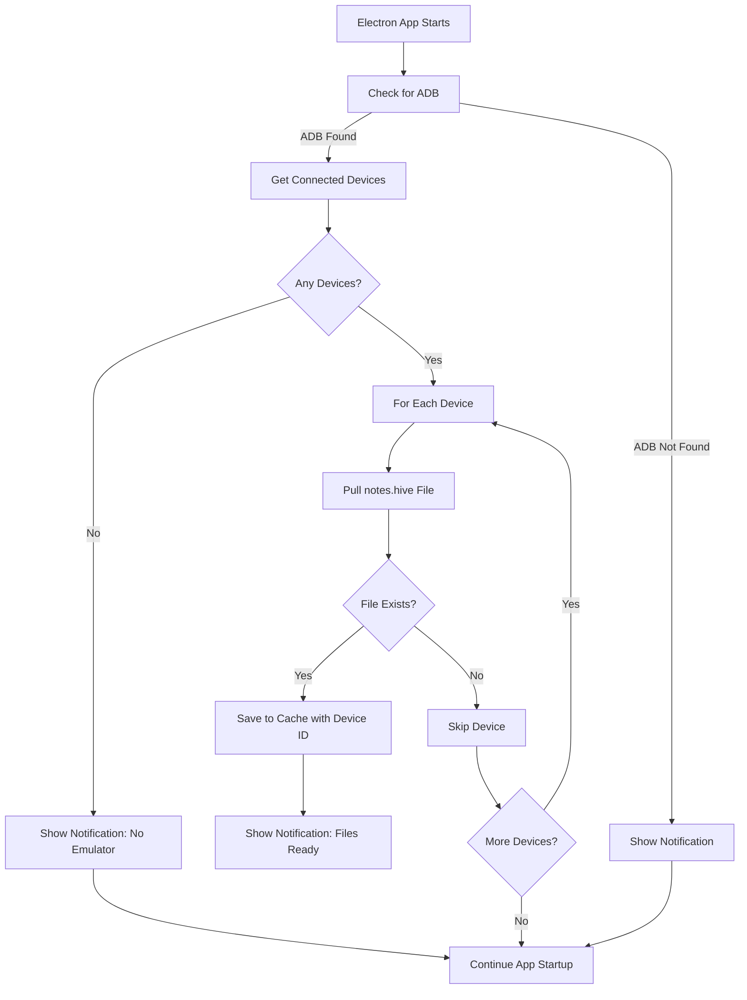
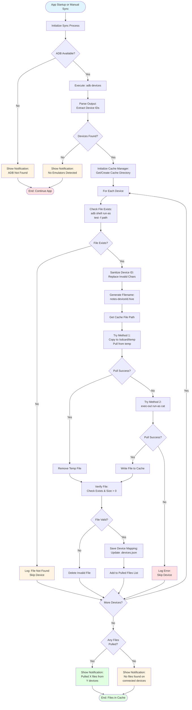
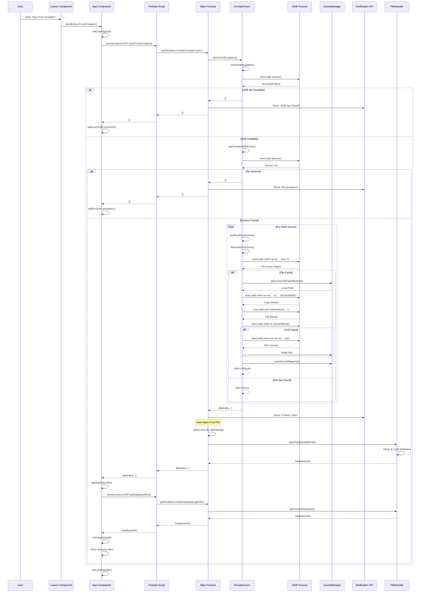
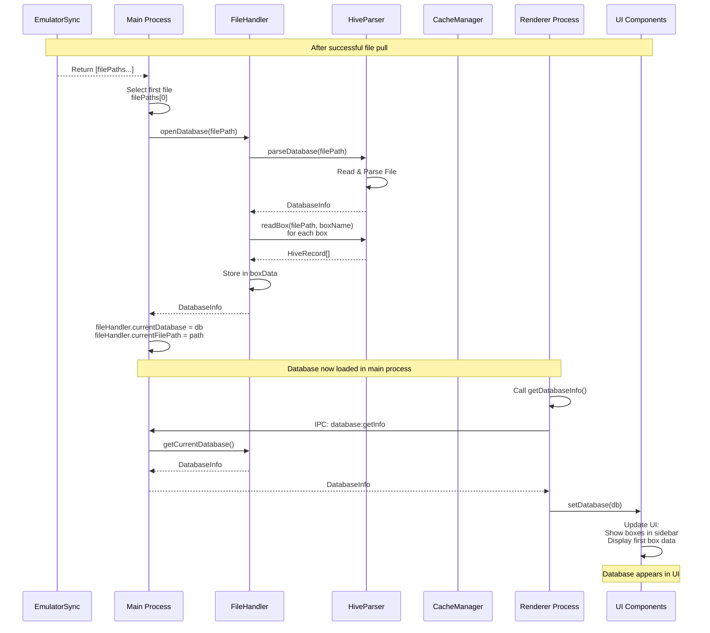
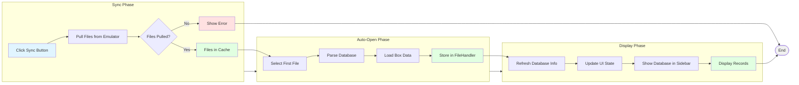
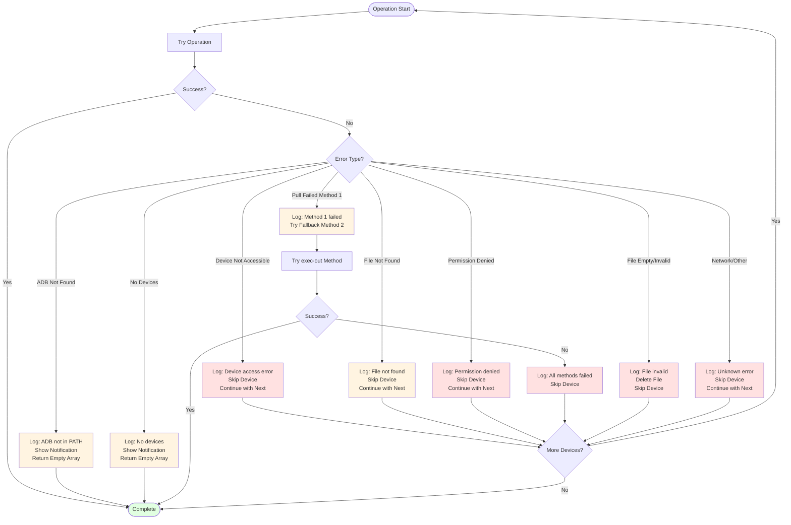

# Auto-Pull Hive Database from Android Emulator

## Overview

Automatically detect connected Android emulators and pull Hive database files (`notes.hive`) when the Electron app starts. Files will be saved to a local cache directory and made available for manual opening.

## Architecture

### High-Level Flow



### Detailed Flowchart



### Manual Sync Flow (UI Button)



### Auto-Open Flow After Sync



### Complete Sync-to-View Flow



### Error Handling Flow



## Implementation Plan

### 1. Create Emulator Sync Service

**File:** `hive_browser/src/main/emulator-sync.ts`

Create a new service that:

- Checks if `adb` is available in PATH
- Lists all connected Android devices using `adb devices`
- For each device, pulls the `notes.hive` file from `/data/data/com.example.slote/app_flutter/`
- Saves files to a local cache directory: `~/.hive-browser/cache/`
- Names files with device ID: `notes-<device-id>.hive` (e.g., `notes-emulator-5554.hive`)
- Handles errors gracefully (device not accessible, file doesn't exist, etc.)

**Key functions:**

- `checkAdbAvailable(): Promise<boolean>` - Verify ADB is installed
- `getConnectedDevices(): Promise<string[]>` - Get list of device IDs
- `pullHiveFile(deviceId: string): Promise<string | null>` - Pull file from specific device, returns local path
- `syncFromEmulators(): Promise<string[]>` - Main function that syncs from all devices, returns array of local file paths

### 2. Create Cache Directory Manager

**File:** `hive_browser/src/main/cache-manager.ts`

Utility to manage the local cache directory:

- Create cache directory if it doesn't exist: `~/.hive-browser/cache/` (or `%APPDATA%/.hive-browser/cache/` on Windows)
- Clean up old files (optional: keep last N files or files from last 7 days)
- Provide path utilities for cache directory

### 3. Integrate into Main Process

**File:** `hive_browser/src/main/main.ts`

Modify `app.whenReady()` to:

1. Call `syncFromEmulators()` after window creation
2. Show system notifications for:

   - Success: "Pulled X database file(s) from emulator(s)"
   - No emulator: "No Android emulators detected"
   - ADB not found: "ADB not found. Install Android SDK platform-tools"
   - Errors: "Failed to pull database from emulator"

**Location:** Add sync call in `app.whenReady().then()` after `createWindow()`

### 4. Add IPC Handler for Manual Sync

**File:** `hive_browser/src/main/main.ts`

Add IPC handler `emulator:sync` that allows manual triggering of sync from renderer:

- Can be called from UI button "Sync from Emulator"
- Returns array of pulled file paths

### 5. Update Preload Script

**File:** `hive_browser/src/main/preload.ts`

Expose new API method:

```typescript
syncFromEmulator: (): Promise<string[]> => ipcRenderer.invoke("emulator:sync");
```

### 6. Update Renderer (Optional UI Enhancement)

**File:** `hive_browser/src/renderer/components/Layout.tsx`

Add optional "Sync from Emulator" button that:

- Calls `window.electronAPI.syncFromEmulator()`
- Shows loading state
- Displays success/error message

### 7. Add Dependencies

**File:** `hive_browser/package.json`

No new npm dependencies needed - we'll use Node.js built-in `child_process` to execute `adb` commands.

### 8. Error Handling

Handle these scenarios:

- ADB not in PATH → Show notification, continue normally
- No devices connected → Show notification, continue normally
- Device not accessible → Skip device, continue with others
- File doesn't exist on device → Skip device, continue with others
- Permission denied → Skip device, log error
- Network issues → Skip device, log error

### 9. File Naming Convention

Files will be saved as:

- `notes-<device-id>.hive` (e.g., `notes-emulator-5554.hive`)
- If device ID contains invalid filename characters, sanitize them
- Store device ID mapping in a JSON file for reference: `cache/.devices.json`

### 10. Configuration (Optional)

**File:** `hive_browser/src/main/config.ts` (optional)

Allow configuration of:

- Package name (default: `com.example.slote`)
- Box name (default: `notes`)
- Cache directory path
- Auto-sync on startup (default: true)

## Files to Create/Modify

1. **Create:** `hive_browser/src/main/emulator-sync.ts` - Core sync logic
2. **Create:** `hive_browser/src/main/cache-manager.ts` - Cache directory management
3. **Modify:** `hive_browser/src/main/main.ts` - Add sync on startup and IPC handler
4. **Modify:** `hive_browser/src/main/preload.ts` - Expose sync API
5. **Modify:** `hive_browser/src/renderer/components/Layout.tsx` - Add optional sync button (optional)

## Implementation Status

✅ **All tasks completed**

### Completed Files:

- ✅ `hive_browser/src/main/cache-manager.ts` - Cache directory management with cleanup utilities
- ✅ `hive_browser/src/main/emulator-sync.ts` - ADB detection, device listing, and file pulling
- ✅ `hive_browser/src/main/main.ts` - Startup sync integration and IPC handler
- ✅ `hive_browser/src/main/preload.ts` - Exposed `syncFromEmulator()` API
- ✅ `hive_browser/src/renderer/components/App.tsx` - Added sync handler and TypeScript interface
- ✅ `hive_browser/src/renderer/components/Layout.tsx` - Added "Sync from Emulator" button

### Features Implemented:

- ✅ Automatic sync on app startup
- ✅ Support for multiple emulators (pulls from all connected devices)
- ✅ System notifications for sync status
- ✅ Manual sync via UI button
- ✅ Error handling for all edge cases
- ✅ File naming with device IDs
- ✅ Cache directory management
- ✅ Device ID mapping storage

## Testing

1. Test with no emulator running → Should show notification
2. Test with one emulator → Should pull file successfully
3. Test with multiple emulators → Should pull files from all
4. Test with ADB not in PATH → Should show notification
5. Test with device that doesn't have the app installed → Should skip gracefully

## Notes

- Uses `child_process.exec` to run `adb` commands
- Cache directory is created in app's userData directory for cross-platform compatibility:
  - macOS: `~/Library/Application Support/hive-browser/cache`
  - Windows: `%APPDATA%/hive-browser/cache`
  - Linux: `~/.config/hive-browser/cache`
- Files are pulled synchronously per device, but the process is non-blocking (runs after window creation)
- Uses `run-as` command to access app's private directory without root access
- Falls back to `exec-out` method if standard pull fails
